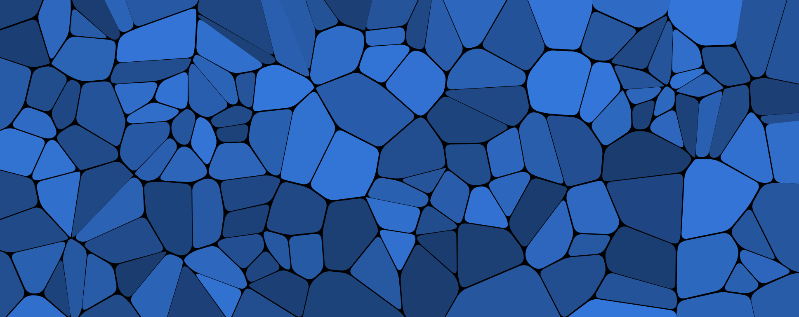

# Voronoi Generator
> An interactive tool for generating **custom Voronoi diagrams** with real-time adjustments.

<div style="display: grid; grid-template-columns: 1fr 1fr; gap: 10px; justify-content: center; align-items: center;">
  
  
  
  
</div>

<br>

## Features
- Custom **colors, textures, and density settings**.
- Save & load configurations (`.json`).
- Export Voronoi diagrams as **high-resolution PNG images**.
- Interactive user interface with **real-time updates**.
- Logging system for monitoring rendering times and settings.

## Installation

### Requirements
- Python 3.8+  
- Jupyter Notebook (`pip install jupyterlab` if not installed)

### Install Dependencies
```bash
pip install -r requirements.txt
```

## Usage
1. Open **`voronoi.ipynb`** in Jupyter Notebook (`jupyter notebook` in a terminal).
2. Adjust parameters using **interactive sliders and dropdown menus**.
3. Generate and preview the **Voronoi diagram**.
4. Save configurations for future use.
5. Export generated images in `.png` format.

## Example Outputs
<div style="display: grid; grid-template-columns: 1fr 1fr; gap: 10px; justify-content: center; align-items: center;">
  <figure>
    
    <figcaption><em>Georgy Voronoy</em></figcaption>
  </figure>
  <figure>
    
    <figcaption><em>High-Detail Tiger</em></figcaption>
  </figure>
</div>


<br>

## Benchmark

Performance tests were conducted using different configurations to assess execution speed.  
Below are results measured on a **Intel Core i7-12700H / 16GB RAM** system.

| Setting | Number of Points | Texture Mode | Execution Time (seconds) |
|---------|-----------------|--------------|--------------------------|
| Low     | 100             | None         | 0.2s                     |
| Medium  | 500             | None         | 1.1s                     |
| High    | 1000            | Texture      | 3.5s                     |

**Observations**:
- Increasing the number of points **significantly affects execution time**.
- Using textures **increases rendering time** by ~30-50%.
- The script remains **responsive under 500 points** but slows beyond 1000.

**Optimization Tips**:
- If performance is slow, **reduce the number of points**.
- **Disable textures** for faster generation.
- Consider **running on a more powerful GPU/CPU** for large diagrams.

<br>

---

## Contact
📩 **Email**: [mathieu.sterlin@gmail.com](mailto:mathieu.sterlin@gmail.com)  
🐙 **GitHub**: [mathieu-portfolio](https://github.com/mathieu-portfolio/)

